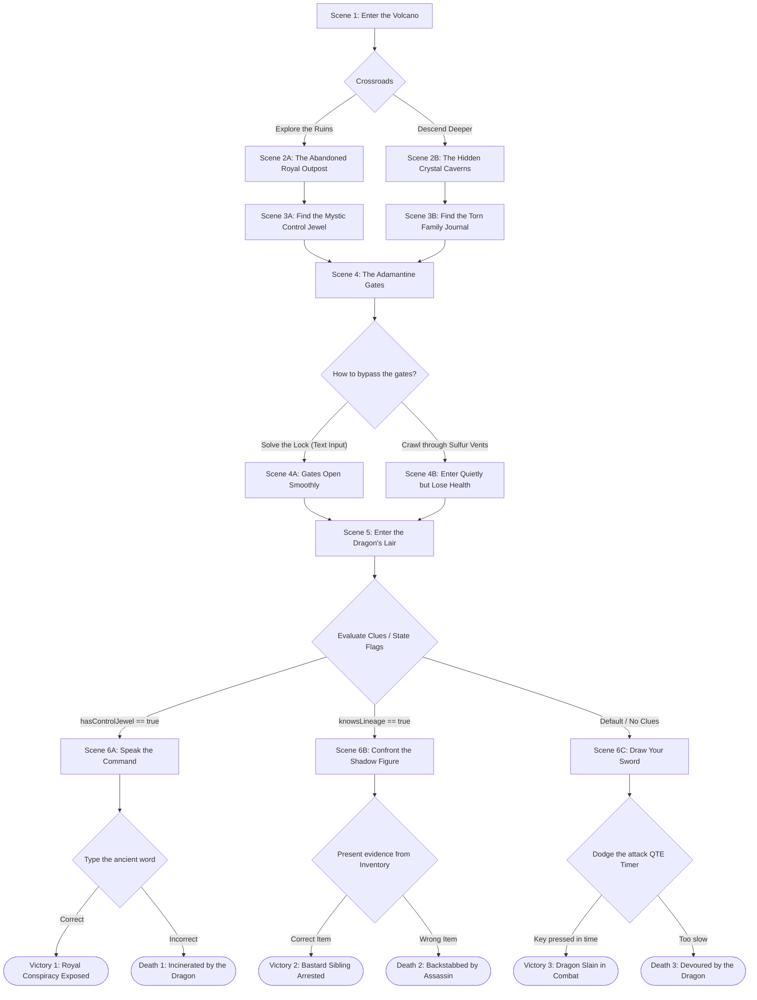

```mermaid
flowchart TD
    %% Act 1: The Descent
    A[Scene 1: Enter the Volcano] --> B{Crossroads}
    B -- Explore the Ruins --> C[Scene 2A: The Abandoned Royal Outpost]
    B -- Descend Deeper --> D[Scene 2B: The Hidden Crystal Caverns]
    
    %% Act 2: Gathering Clues
    C --> E[Scene 3A: Find the Mystic Control Jewel]
    D --> F[Scene 3B: Find the Torn Family Journal]
    
    %% Act 3: The Gate Puzzle
    E --> G[Scene 4: The Adamantine Gates]
    F --> G
    
    G --> H{How to bypass the gates?}
    H -- Solve the Lock (Text Input) --> I[Scene 4A: Gates Open Smoothly]
    H -- Crawl through Sulfur Vents --> J[Scene 4B: Enter Quietly but Lose Health]
    
    %% Act 4: The Dragon's Lair
    I --> K[Scene 5: Enter the Dragon's Lair]
    J --> K
    
    K --> L{Evaluate Clues / State Flags}
    
    %% Act 5: The Branching Finales
    L -- hasControlJewel == true --> M[Scene 6A: Speak the Command]
    L -- knowsLineage == true --> N[Scene 6B: Confront the Shadow Figure]
    L -- Default / No Clues --> O[Scene 6C: Draw Your Sword]
    
    %% Finale 1: The Royal Conspiracy
    M --> M1{Type the ancient word}
    M1 -- Correct --> P([Victory 1: Royal Conspiracy Exposed])
    M1 -- Incorrect --> S([Death 1: Incinerated by the Dragon])
    
    %% Finale 2: The Bastard Sibling
    N --> N1{Present evidence from Inventory}
    N1 -- Correct Item --> Q([Victory 2: Bastard Sibling Arrested])
    N1 -- Wrong Item --> T([Death 2: Backstabbed by Assassin])
    
    %% Finale 3: The Monster Hunt
    O --> O1{Dodge the attack QTE Timer}
    O1 -- Key pressed in time --> R([Victory 3: Dragon Slain in Combat])
    O1 -- Too slow --> U([Death 3: Devoured by the Dragon])
```